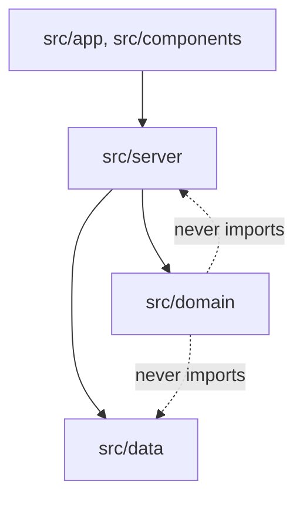
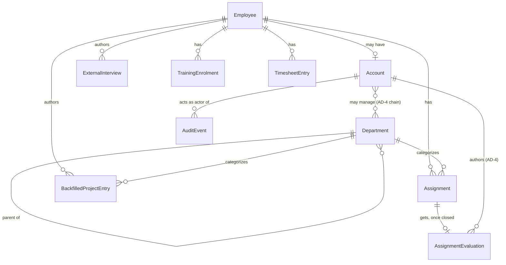

# Architecture Spine — L&D Manager Workspace

## Design Paradigm

Hexagonal / Ports & Adapters, expressed as horizontal layers rather than a strict core/port/adapter folder split: `src/domain/` is the dependency-free core (zero framework or database imports — already true of `leave.ts` and `timesheet.ts`); `src/server/` holds both the repository *interfaces* and their *implementations* together (see `attendance-store.ts`'s existing `AttendanceStore` pattern) rather than splitting ports from adapters into separate layers; `src/data/` holds only the raw storage (fixture today, Supabase tomorrow) that `server/`'s implementations wrap; `src/app` + `src/components` are the UI adapter. New features extend each horizontal layer — they do not get their own feature folder (`src/features/x/`). This is how staff-attendance was already built.



## Invariants & Rules

### AD-1 — Repository interface for every entity, with self-consistent identity, errors, and invariant enforcement

- **Binds:** all persistence access (employees, interviews, training, assignments, evaluations, backfilled entries, departments).
- **Prevents:** the fixture-to-Supabase swap (SRS 11.2) requiring caller changes; a store silently trusting a caller-supplied id as sufficient scoping instead of the calling server action's session-derived value; divergent null-vs-thrown-error failure contracts across stores; a cross-entity invariant enforced only in application/domain code, bypassable by a future caller (migration, batch job, admin tool) once a store-layer or DB-layer check would have caught it.
- **Rule:** every entity is accessed through a store/repository interface defined and implemented in `src/server/`, matching `AttendanceStore`'s shape — never a direct fixture/DB import from domain code or a server action (`auth.ts`'s current direct `import { employees }` is the one pre-existing violation; fix it when this lands). Not-found and validation failures use one canonical shape across every store: `null` for a "not found" read, a typed error thrown for validation/authorization failures — never a mix of both for equivalent cases. A cross-entity invariant that will become a DB constraint once Supabase lands (e.g., "no Evaluation on a non-closed Assignment") is enforced at the store layer, not the domain layer — a domain function may also check it, but the store is the load-bearing point. Visibility scoping is **asymmetric by role, not just self-scoping**: an Administrator-role query is authorized to read any employee's records; a Staff-role query is authorized only for its own session's `employeeId`. A store applies whichever rule matches the caller's role — same-actor-owns-record (attendance, interviews, backfilled entries) is the Staff-role case, not the universal one. Named uniqueness constraints (SRS 11.2: Employee ID, primary email, skill/training/interview identifiers) have no app-layer check in today's fixture-backed implementation — an accepted gap while data is fixture/demo-authored, not a live risk; Supabase's own `UNIQUE` constraints are the enforcement point once persistence lands (see Deployment & Environments).

### AD-2 — Assignment, AssignmentEvaluation, and BackfilledProjectEntry are three separate records, each with a single writer

- **Binds:** PRD FR-6, FR-7, FR-8, FR-9.
- **Prevents:** mixing Administrator-authored and manager/employee-authored writes on one table; losing assignment history on reassignment (today's bug — closing overwrote instead of archiving); evaluation-shaped fields quietly reappearing on `Assignment`; two stores both mutating `Assignment`'s closed-state fields; an implicit, easy-to-miss provenance signal; a uniqueness rule nobody actually enforces.
- **Rule:** `Assignment` carries only FR-6's fields (client, project name, Department, allocation, start date, status, completion date) — no evaluation-shaped fields, not even as a "temporary" nullable column. Only `assignments-store.ts` writes `status`/`completionDate`; no other store closes an Assignment as a side effect — `assignment-evaluations-store.ts` rejects a write against a non-closed Assignment rather than force-closing it. An employee has at most one open (current) Assignment at a time — `assignments-store.create()` rejects a new Assignment for an employee who already has one open, matching FR-6's own consequence. `AssignmentEvaluation` is a separate 1:1 record (one per Assignment), enforced in application code today (Supabase's own `UNIQUE` constraint is the target once persistence lands, not a substitute for the app-layer check now), attached only once its Assignment is closed. `BackfilledProjectEntry` is a wholly separate, employee-authored entity; every row returned to an Administrator-facing history view carries an explicit, materialized `provenance: 'assignment' | 'backfilled'` field — never inferred from which table or store it came from.

### AD-3 — LMS integration sits behind a stub adapter with a concrete return and failure contract

- **Binds:** PRD FR-4, and FR-5 (via `training-store.ts`, which wraps it).
- **Prevents:** FR-4/FR-5's feature code coupling to BrainStation LMS's still-unknown integration mechanics; two independently-built callers guessing incompatible error/return shapes; a second call path to LMS data that bypasses FR-5's fixture/LMS history-merge logic.
- **Rule:** `src/server/lms-client.ts` exposes `listCurrentEnrolments(employeeId): Promise<{ data: Enrolment[]; asOf: string; stale: boolean }>`, throwing `LmsUnavailableError` only when unreachable outright; a stale-but-reachable response sets `stale: true` rather than throwing. `training-store.ts` is the sole caller of `lms-client.ts` and the sole AD-1 repository of record for all TrainingEnrolment reads, current and historical (FR-4 and FR-5 alike) — no other module calls `lms-client.ts` directly. The stub implementation satisfies this exact contract; only the implementation behind it changes once real BrainStation LMS access is confirmed. **Retires `docs/SRS.md` NFR-REL-001** ("no failure mode where partial data loads, because there is no external data source") — both this adapter and the SRS-11.2 Supabase persistence move introduce genuine external dependencies the prototype never had. Successor contract: every network-dependent read (LMS or, once it lands, Supabase) surfaces a stale/unavailable/loading state to its caller rather than silently returning partial or stale-looking-fresh data — this AD's `stale` flag is the first instance of that pattern, not a one-off for LMS alone.

### AD-4 — Department Manager authorization resolves to a set; any member may write or amend, authorship always recorded

- **Binds:** PRD FR-7's write-authorization; the eventual accounts/departments schema.
- **Prevents:** an RLS policy or permission check written against "is Administrator" that breaks once a second, less-privileged department manager account exists; two implementations disagreeing on whether a second authorized manager's write is rejected or silently clobbers the first; no record of who actually wrote an evaluation once more than one account is authorized; the authorized set going stale mid-session as FR-10 reassigns managers.
- **Rule:** who may write or amend an `AssignmentEvaluation` is the Assignment's Department's own manager, plus every ancestor Department's manager, plus every Administrator-role account, unconditionally — "up to and including the Administrator" is a permanent floor of authority, not a fallback that stops applying once every level in the chain has its own manager. This authorized set is computed fresh at write time, never cached in the session token, so an FR-10 manager reassignment takes effect on the next write without requiring re-authentication. Any authorized account may create the Evaluation if none exists, or amend it if one does — not insert-once-then-immutable; every write (create or amend) records `authoredBy` (the writing account) and `updatedAt`, and an amendment does not require being the original author. `[ADOPTED]` — matches the confirmed org-chart pattern where a manager's manager retains authority over their reports.

### AD-5 — Department is a self-referencing hierarchy; cycles rejected at write time

- **Binds:** PRD FR-6, FR-8, FR-10; AD-4's parent-chain walk.
- **Prevents:** treating Department as a flat enum when the real org structure is hierarchical; a cycle in `parent_department_id` hanging or crashing AD-4's authority-chain walk in production — the exact code path gating every `AssignmentEvaluation` write.
- **Rule:** `Department` has an optional `parent_department_id`. `departments-store.ts` rejects any write (create, or reassigning a parent) that would introduce a cycle — this is the load-bearing guard, enforced at write time, not left to the FR-10 UI alone. `assignments-store.ts` and `backfilled-project-store.ts` (AD-1) reject a write referencing a Department that doesn't currently exist in the Administrator-managed list — FR-10's referential-integrity consequence, owned here since both stores draw from this AD's list. `src/domain/departments.ts`'s authority-chain walker (the pure resolver AD-4 depends on) additionally guards against a cycle defensively (a visited-set check that halts and surfaces an error rather than looping) as a second, non-load-bearing safety net — its presence never excuses the store-layer guard. `[ADOPTED]` — seed data: `L&D` (top-level, managed by the Administrator) and `Central R&D` (parent = L&D, manager not yet assigned — resolves to L&D's manager per AD-4). All other departments are stubbed placeholders, added later through FR-10 itself, not a migration.

### AD-6 — No self-registration; all account creation funnels through one repository method

- **Binds:** the account/identity schema (SRS 11.1), PRD §4.4.
- **Prevents:** a public sign-up flow being added by default; a second, side-effect account-creation path (e.g., inside FR-10's manager-assignment action) constructing an Account with different invariants than the deliberate provisioning flow.
- **Rule:** every Administrator and Staff account is created by an Administrator, through exactly one repository method (e.g., `accounts-store.ts`'s `create()`). No other server action creates an Account as a side effect — an action that needs an Account to exist (e.g., FR-10 assigning a manager to a Department) calls that same creation method rather than constructing one inline. There is no public registration endpoint or flow, anywhere. Account deactivation (SRS 11.1) goes through the same store's counterpart method (`accounts-store.deactivate()`): it denies the account's next and all subsequent requests immediately, while preserving its historical records (Assignments, Evaluations, interviews, etc.) completely unchanged — deactivation is not deletion. `[ADOPTED]`.

### AD-7 — Every server action validates input with zod before touching a store

- **Binds:** every new server action (`interviews-actions.ts`, and the rest of the Capability → Architecture Map below).
- **Prevents:** some stories validating input with zod and others with ad hoc checks (or none) for equivalent request shapes, despite zod already being an installed, named dependency.
- **Rule:** every new server action validates its `FormData`/input against a zod schema before calling into a store — the convention going forward, not a retrofit requirement on `attendance-actions.ts`'s already-shipped, hand-validated code.

## Consistency Conventions

| Concern | Convention |
| --- | --- |
| Naming (entities, files, interfaces, events) | Entities: PascalCase singular (`Employee`, `Department`, `Assignment`, `AssignmentEvaluation`, `BackfilledProjectEntry`). Files: kebab-case, matching `staff-attendance.tsx` / `attendance-actions.ts`. |
| Data & formats (ids, dates, error shapes, envelopes) | Dates: ISO 8601 strings at rest (`session.ts`, `timesheet.ts` pattern). Employee IDs: `^BS-\d{4}$` (already enforced in `session.ts`). Server-action results: `{ error, message }` (`ActionState`, `attendance-actions.ts`). A record's subject (`employeeId`) is always derived from the entity being acted on — looked up from the target record (e.g., the Assignment an Evaluation is being written for), never assumed to equal the acting session's own id. Where author and subject differ (`AssignmentEvaluation`: manager authors, employee is the subject), the author is a separate `authoredBy` field (AD-4); the ownership-from-session convention governs `authoredBy`, not `employeeId`, for that entity. |
| Field immutability | A recurring shape, not per-entity ad hoc design: identifying fields set at creation (FR-2's interview company/role/date; FR-6/FR-7's Assignment client/project/Department/dates) lock after creation: only a status/outcome field stays editable afterward. |
| Testing | Every new `src/domain/*` or `src/server/*` module gets a matching `tests/*.test.ts`, matching the existing one-test-file-per-module pattern (`docs/ARCHITECTURE.md` Test Layout; enforced by `.github/workflows/ci.yml` on every PR). |
| State & cross-cutting (mutation, errors, logging, config, auth) | Record ownership is always taken from the signed session, never the submitted form, for same-actor-and-subject entities (`attendance-actions.ts`; PRD FR-1/FR-8 consequences) — see Data & formats above for the author/subject split on `AssignmentEvaluation`. Session/auth: hand-rolled HMAC cookie today, Supabase Auth once SRS 11.1 lands (PRD §4.4) — session shape stays a discriminated union by role. |

## Stack

| Name | Version |
| --- | --- |
| Next.js | 15.5.26 (bumped + web-verified 2026-09-30 for the 2026-09-22 critical out-of-band security patch, within the existing major — typecheck/build/test verified clean. 16.3.x is current major; 15.x is Maintenance LTS through 2026-10-21 — the major upgrade itself is deferred, see Deferred) |
| React / React DOM | 19.3.0 (web-verified 2026-09-30, current-latest) |
| TypeScript | 5.9.3 (web-verified 2026-09-30; TypeScript 7.0 GA'd 2026-07-08 but lacks a stable programmatic API as of GA — staying on 5.9.x until that lands, see Deferred) |
| @supabase/supabase-js | 2.117.2 (bumped + web-verified 2026-09-30, current-latest; still unused — typecheck/build verified clean) |
| @supabase/ssr | 0.12.7 (bumped + web-verified 2026-09-30, current-latest; still unused — typecheck/build verified clean) |
| zod | 4.6.5 (web-verified 2026-09-30, current-latest; still unused anywhere in `src/` today — AD-7 is where it starts being used) |
| Vitest | 3.2.7 (web-verified 2026-09-30; Vitest 4.0 and 5.0 both shipped in 2026 with real breaking changes — staying on 3.x until evaluated, see Deferred) |
| Playwright | 1.63.0 (web-verified 2026-09-30, current-latest) |
| Hosting | Vercel — see Deployment & Environments below for what's still undecided |

## Structural Seed

```text
src/
  domain/               # Pure rules, zero framework/DB imports
    leave.ts
    timesheet.ts
    csv.ts
    departments.ts      # NEW — Department hierarchy/authority-chain resolution (AD-4/AD-5), pure & testable like leave.ts
  server/                # Repository interfaces + implementations, session, server actions
    session.ts
    auth.ts
    accounts-store.ts               # NEW — AD-6, sole account-creation path
    attendance-store.ts
    attendance-actions.ts
    interviews-store.ts             # NEW — FR-1..3
    interviews-actions.ts           # NEW
    assignments-store.ts            # NEW — FR-6, FR-9; sole writer of Assignment status/completionDate (AD-2)
    assignment-evaluations-store.ts # NEW — FR-7 (AD-2, AD-4)
    backfilled-project-store.ts     # NEW — FR-8
    departments-store.ts            # NEW — FR-10; cycle rejection lives here (AD-5)
    training-store.ts               # NEW — FR-5 history + FR-4 current, sole caller of lms-client.ts (AD-3)
    lms-client.ts                   # NEW — FR-4, the AD-3 adapter (stub first)
    leave-store.ts                  # NOT YET ARCHITECTED — SRS 11.4, see Deferred; domain/leave.ts already exists, has no caller
    leave-actions.ts                # NOT YET ARCHITECTED — SRS 11.4, see Deferred
  data/                  # Fixture today; Supabase-backed implementations wrap this once SRS 11.2 lands
    employees.ts
  components/             # Client components
    login.tsx
    portal.tsx
    staff-attendance.tsx
    # + new: interview / training / assignment-history views inside the staff portal
  app/
    layout.tsx
    page.tsx
    styles.css
```



`AuditEvent` (append-only: actor, target, action, safe metadata, server timestamp — per `docs/ARCHITECTURE.md`'s existing target schema) is named here because it's part of the very persistence migration this spine binds to and is tied to PRD's `SM-C1` counter-metric and `NFR-SEC-004`; its target reference is polymorphic (any security-relevant entity), not drawn as a strict per-entity relationship above to avoid overstating what's decided — see Deferred.

## Deployment & Environments

**Known today:** a single environment, Vercel-hosted, no database (fixture-backed). `DEMO_SESSION_SECRET` / `DEMO_ADMIN_EMAIL` / `DEMO_ADMIN_PASSWORD` / `DEMO_STAFF_PASSWORD` are the only environment-configured secrets.

**Deferred, named explicitly** (carried forward from `docs/ARCHITECTURE.md`'s own "Open decisions" rather than left to go silent a second time):
- Supabase organisation/project ownership, and how many environments (dev/staging/prod) map to how many Supabase projects.
- Forward-only migration tooling — what runs migrations, when, and who's authorized to.
- RLS-policy authoring, review, and test strategy — `docs/ARCHITECTURE.md`'s own production target already calls for "RLS/policy tests and integration tests against a real database"; this spine's Stack table pins Vitest/Playwright without yet engaging with that requirement.
- `AuditEvent` schema and write path — named in the ERD above, but its exact shape, who writes it, and how it's queried are undecided.
- Secrets/env-var strategy across the `DEMO_SESSION_SECRET` → Supabase Auth cutover.
- Whether the Phase 1 cutover (SRS 11.1/11.2) is big-bang or staged/feature-flagged.
- Whether Vercel + Supabase remains the target stack post-demonstration at all — `docs/ARCHITECTURE.md` already names this as open, not new here.

## Capability → Architecture Map

| Capability / Area | Lives in | Governed by |
| --- | --- | --- |
| FR-1..3 External interviews | `src/server/interviews-*`, staff portal component | AD-1, AD-7, Consistency Conventions |
| FR-4 LMS current enrolments | `src/server/lms-client.ts`, `src/server/training-store.ts` | AD-3 |
| FR-5 Training history | `src/server/training-store.ts` | AD-1, AD-3 |
| FR-6 Assignment create/close | `src/server/assignments-store.ts` | AD-1, AD-2 |
| FR-7 Assignment Evaluation | `src/server/assignment-evaluations-store.ts` | AD-2, AD-4 |
| FR-8 Backfilled Project Entry | `src/server/backfilled-project-store.ts` | AD-1, AD-2 |
| FR-9 Visibility rules | store-layer query scoping (all `*-store.ts`) | AD-1 |
| FR-10 Department management | `src/server/departments-store.ts`, `src/domain/departments.ts` | AD-4, AD-5 |
| SRS 11.1/11.2 Identity & persistence | `src/server/session.ts`, `src/server/auth.ts`, `src/server/accounts-store.ts`, `src/data/` → Supabase | AD-6, Stack, Deployment & Environments |
| SRS 11.4 Leave workflow | `src/domain/leave.ts` (exists), `src/server/leave-*` (not yet architected) | Not yet architected — see Deferred |
| PRD SM-C1 / NFR-SEC-004 audit trail | `AuditEvent` (ERD) | Deployment & Environments (undecided — see Deferred) |
| PRD SM-1, SM-2, SM-3 measurement | — | Not yet architected — see Deferred |

## Deferred

- **SRS 11.4 Leave workflow architecture** — entirely unarchitected at the store/action layer. `src/domain/leave.ts`'s pure logic already exists and is fully tested; only the repository/server-action wiring (AD-1's pattern) and the holiday-calendar decision (PRD §4.7) are missing. No new AD needed to close this later — it follows AD-1 like every other entity — but it's named here so it isn't silently dropped a second time.
- **Success Metrics instrumentation (PRD §7)** — SM-1/SM-2 are usage/workflow signals with no dedicated data to build (they're answered by whether FR-1..10 get used, not by new architecture); SM-3 needs the `createdAt`/`closedAt`/evaluated timestamps AD-2's entities already carry, but no query/reporting surface exists yet. SM-C1 (the security counter-metric) depends entirely on the `AuditEvent` design, itself still undecided (see Deployment & Environments) — none of this has been designed, not just left informal.
- **BrainStation LMS's actual integration mechanics** (live API vs. periodic export, auth method, rate limits) — unblocked for build behind AD-3's stub; resolve when IT/vendor access is confirmed (PRD §8).
- **Central R&D's own manager account, and the exact scoped-rights model for any subordinate Department Manager** — AD-4 fixes the *resolution mechanism*; the actual second account and what it can/can't do beyond FR-7 is undefined until it's real (PRD §8 Open Question 4).
- **Additional departments beyond L&D/Central R&D** — a data-seeding task through FR-10 itself, not a structural one.
- **Staff-side interview/training editing vs. SRS 11.3's Administrator edit-rights over the same fields** — needs closer field-level reconciliation at the epics/stories stage (PRD §8 Open Question 2). Interim default holds in the meantime: per FR-2's Out of Scope note, Administrators cannot edit or delete a Staff-authored interview or training entry until this is reconciled.
- **`docs/SRS.md` §2/§3.1's stale actor-model correction** — applied directly to the source document at this run's Close step (see PRD Document Purpose), not modeled as an architectural decision itself.
- **Next.js 15→16 major-version upgrade** — 15.x remains Maintenance LTS (supported through 2026-10-21); the critical security patch is applied (15.5.26), but the major-version decision itself is separate and not forced by this spine.
- **TypeScript 7 / Vitest 4–5 major-version adoption** — TS7 lacks a stable programmatic API as of its GA; Vitest 4/5's breaking changes (mocks auto-cleared, unawaited async assertions now fail, Node/Vite floor bumps) haven't been evaluated against this project's suite. Both stay on their current majors until evaluated.
- **Gating configuration decisions** (org timezone, holiday calendar, retention periods) — System Owner approvals, non-technical, outside this spine's scope (PRD §4.7).
- **Colour-contrast remediation** — independent CSS/token work, no architectural dependency (PRD §4.8).
